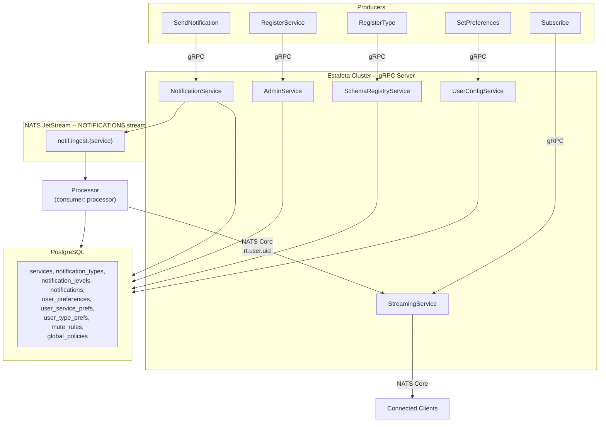
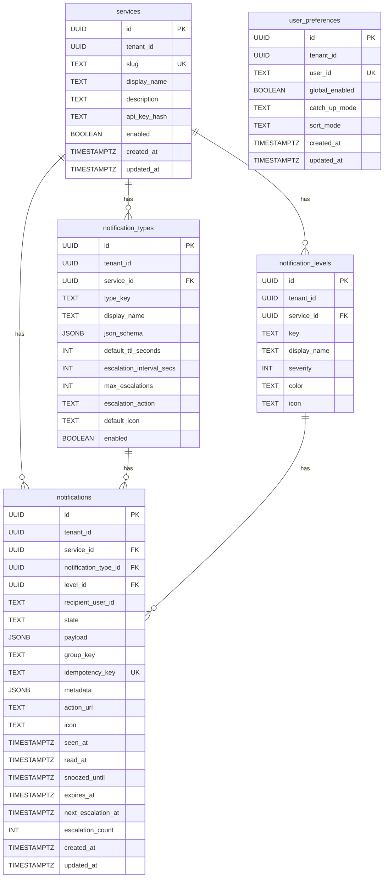

# Estafeta Architecture

## System Overview

Estafeta is a unified notification inbox service built in Rust. Upstream
producer services push notifications into Estafeta via gRPC; end users
consume them exclusively through Estafeta's gRPC query and real-time
streaming APIs. There is no outbound delivery -- no email, push, SMS, or
webhook channels.

Estafeta is stateless and horizontally scalable. It exposes five gRPC
services, uses NATS JetStream for durable ingestion, NATS Core for
real-time fan-out, and PostgreSQL for persistence and coordination.

## NATS Topology

### JetStream Streams

Estafeta creates one JetStream stream at startup (`nats/setup.rs`):

| Stream        | Subjects         | Retention | Storage | Purpose                  |
|---------------|------------------|-----------|---------|--------------------------|
| NOTIFICATIONS | `notif.ingest.>` | WorkQueue | File    | Ingestion pipeline input |

The stream uses WorkQueue retention, meaning each message is delivered to
exactly one consumer and removed after acknowledgment.

### JetStream Consumers

| Consumer    | Stream        | Filter           | Ack Wait | Max Deliver |
|-------------|---------------|------------------|----------|-------------|
| `processor` | NOTIFICATIONS | `notif.ingest.>` | 30s      | 5           |

The consumer is durable and pull-based. When multiple Estafeta instances
run, they form implicit consumer groups -- NATS distributes messages across
all subscribers of the same durable consumer name.

### NATS Core (Pub/Sub)

Real-time events use plain NATS Core (non-JetStream) subjects:

- `rt.user.{user_id}` -- new notification events and unseen count updates
- `rt.user.{user_id}.state` -- state change events (seen, read, snoozed, dismissed, etc.)

These are fire-and-forget. If no subscriber is connected, the message is
dropped. The `StreamingService.Subscribe` RPC opens a server-streaming gRPC
connection that subscribes to these NATS subjects and relays events to the
client.

## PostgreSQL Schema Overview

Key indexes on `notifications` support the background scheduler:
- `idx_notifications_snooze_wake` -- partial index on `snoozed_until` where state is snoozed
- `idx_notifications_expiry` -- partial index on `expires_at` where state is unseen, unread, or read
- `idx_notifications_escalation` -- partial index on `next_escalation_at` where state is unseen or unread
- `idx_notifications_idempotency` -- unique partial index on `idempotency_key`

## Processing Pipeline

Notifications pass through three stages:

### Stage 1: Ingestion

The `NotificationService.SendNotification` RPC validates the payload against
the notification type's JSON schema using the `jsonschema` crate, generates
a UUID, and publishes an `IngestMessage` to `notif.ingest.{service_slug}` on
JetStream. The RPC returns immediately with the notification ID. Batch sends
iterate over each notification in sequence, injecting auth claims into each
inner request.

### Stage 2: Processing

The `Processor` pulls messages from the `processor` consumer on the
NOTIFICATIONS stream. For each message it:

1. Looks up the notification type from cache (or loads from DB and caches).
2. Looks up the notification level and its severity.
3. Loads the user's full preference set (global prefs, service prefs, type prefs, mute rules).
4. Runs preference resolution (see lifecycle.md for hierarchy details).
5. Computes `expires_at` from `default_ttl_seconds` and `next_escalation_at` from escalation config.
6. Inserts the notification row into PostgreSQL with state `unseen`.
7. Publishes a `RealtimeEvent` to `rt.user.{user_id}` via NATS Core (includes
   both the `NewNotification` event and an `UnseenCountUpdate`).

Failed processing results in a NAK, causing JetStream to redeliver (up to
5 times).

### Stage 3: Real-time

The `StreamingService.Subscribe` RPC establishes a server-streaming gRPC
connection. It subscribes to NATS Core subjects `rt.user.{user_id}` and
optionally `rt.user.{user_id}.state`, filters by service slug if requested,
and relays `NotificationEvent` proto messages through an mpsc channel to the
gRPC stream. Events include `NewNotification`, `StateChange`, and
`UnseenCountUpdate`.

## Authentication and Authorization

### Authentication: JWT via Ory Hydra

Every gRPC request passes through `AuthInterceptor`, which:

1. Extracts the Bearer token from the `authorization` metadata header.
2. Decodes the JWT header to find the `kid` (key ID).
3. Looks up the signing key from a cached JWKS key set. On cache miss, forces
   a refresh from the Hydra JWKS endpoint (`hydra_jwks_url`).
4. Validates the token with RS256, optionally checking the issuer (`jwt_issuer`).
5. Extracts `sub` (subject) and `scp`/`scope` claims into an `AuthClaims` struct
   stored in the request extensions.

JWKS keys are refreshed in the background every 30 minutes.

### Authorization: Ory Keto

Fine-grained authorization is enforced via the Ory Keto relation-tuple API:

- **Admin operations** (RegisterService, SetGlobalPolicy, RegisterType, etc.):
  Checks `estafeta:admin#access@{subject}`.
- **Send permission**: Checks `estafeta:services/{service_slug}#send@{subject}`.
- **User operations** (ListNotifications, MarkRead, MarkSeen, etc.): The JWT
  subject must match the `recipient_user_id` -- enforced in application code,
  not Keto.

## Stateless Design

Estafeta instances are fully stateless. Multiple instances coordinate through:

### NATS Consumer Groups

All instances connect to the same durable JetStream consumer. NATS distributes
messages across connected consumers automatically. No leader election or
instance registry is needed.

### SELECT FOR UPDATE SKIP LOCKED

The background scheduler runs on every instance. Three loops run concurrently:

- **Snooze wake-up** (every 30s): selects snoozed notifications past their `snoozed_until`.
- **TTL expiry** (every 60s): selects notifications past their `expires_at`.
- **Escalation** (every 60s): selects unseen/unread notifications past their `next_escalation_at`.

All three use `SELECT ... FOR UPDATE SKIP LOCKED` with a batch size of 100.
This PostgreSQL feature ensures that when multiple instances run the same
query simultaneously, each instance locks and processes a different set of
rows. Rows already locked by another instance are skipped rather than blocked
on.

## Caching Strategy

Estafeta uses `moka` (a concurrent async cache for Rust) with three
in-process caches managed by `AppCaches`:

| Cache                 | Key Format                   | Max Capacity | TTL   |
|-----------------------|------------------------------|-------------|-------|
| `notification_types`  | `{service_slug}:{type_key}`  | 10,000      | 5 min |
| `notification_levels` | `{service_slug}:{level_key}` | 10,000      | 5 min |
| `user_prefs`          | `{user_id}`                  | 10,000      | 1 min |

User preferences use a shorter TTL (60s) because they change more frequently.
Schema-related caches (types and levels) use 5-minute TTLs. On schema updates
via `SchemaRegistryService.RegisterType` or `UpdateType`, the cache entry is
explicitly invalidated so subsequent lookups hit the database.

Note: since caches are in-process, different instances may serve slightly
stale data within the TTL window. This is an intentional trade-off for
throughput over strict consistency.

## Key Design Decisions and Trade-offs

1. **Unified inbox, not a delivery dispatcher.** Estafeta stores notifications
   and makes them available through its gRPC API. There is no outbound
   delivery to email, push, SMS, or webhooks. Consuming applications poll or
   stream notifications through the API.

2. **Three-tier read state.** Notifications progress through unseen, unread,
   and read. The unseen state drives the bell badge count. Opening the
   notification dropdown triggers `MarkSeen`, transitioning all unseen
   notifications to unread. This separates "appeared in the user's viewport"
   from "explicitly acknowledged."

3. **Async-first with JetStream work queues.** The `SendNotification` RPC
   returns immediately after publishing to JetStream. This decouples
   ingestion latency from processing.

4. **WorkQueue retention.** Each ingested message is processed by exactly one
   consumer instance, then removed. This avoids duplicate processing without
   requiring application-level deduplication (idempotency keys provide an
   additional safety net at the database level via a unique partial index).

5. **NATS Core for real-time.** Real-time events use plain pub/sub rather
   than JetStream. If no client is connected, the event is dropped. This is
   acceptable because the notification is already persisted; clients can poll
   or reconnect and fetch from the database.

6. **PostgreSQL as coordinator.** Rather than adding a distributed lock
   service, the scheduler uses `FOR UPDATE SKIP LOCKED` for distributed work
   coordination. This keeps the operational footprint small.

7. **Tonic sync interceptor with block_in_place.** The `AuthInterceptor` uses
   `tokio::task::block_in_place` to call async JWKS validation from a sync
   interceptor. This is a pragmatic workaround for tonic's synchronous
   interceptor API and works correctly on the multi-threaded tokio runtime.

8. **In-process caching only.** There is no shared cache (e.g., Redis). This
   keeps the architecture simpler and avoids a network hop for hot-path
   lookups, at the cost of each instance maintaining its own cache with
   potential short-lived staleness.

9. **Tenant ID columns.** Every table includes a `tenant_id` column, even
   though multi-tenancy is not yet enforced in queries. This allows future
   multi-tenant isolation without a schema migration.
