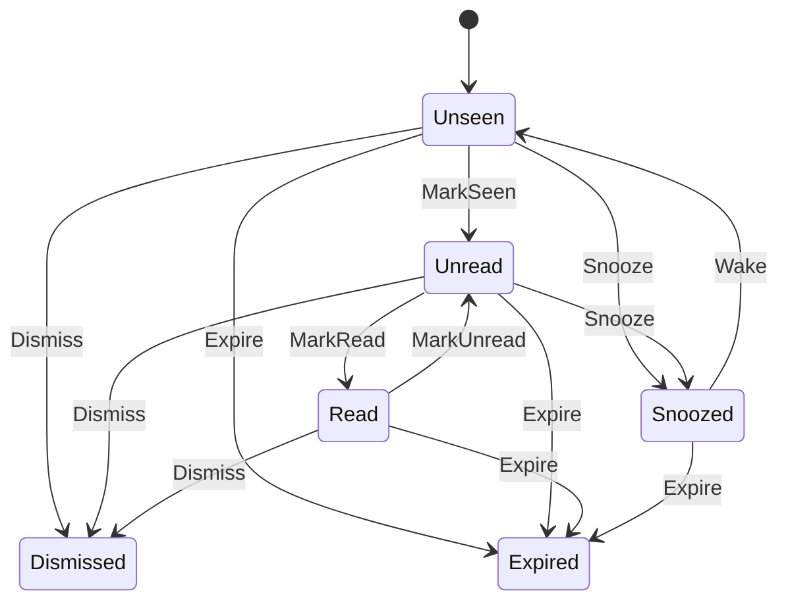
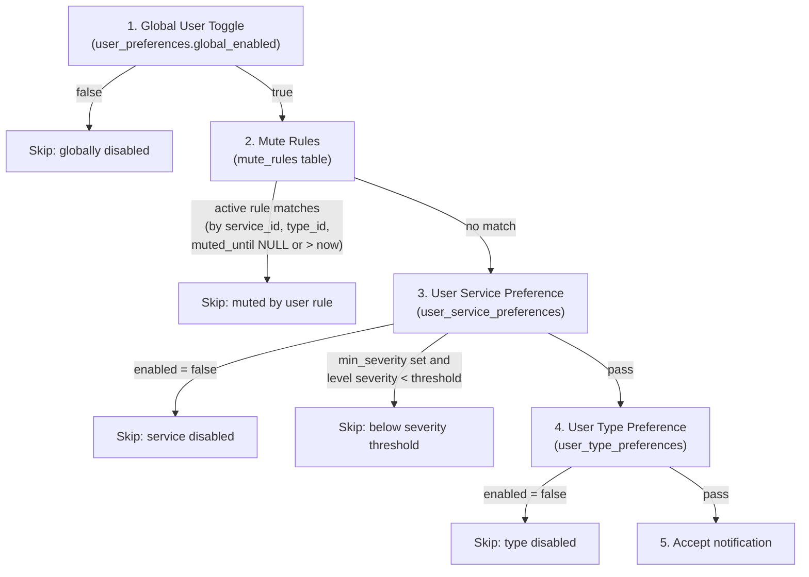

# Notification Lifecycle

## State Machine

Every notification has a `state` column constrained to one of six values. The
state machine is implemented in `lifecycle/state_machine.rs` and enforced both
in Rust (via the `NotificationState::apply` method) and at the database level
(via a CHECK constraint and conditional UPDATE WHERE clauses).



### Valid Transitions

| From State | Allowed Transitions                          |
|------------|----------------------------------------------|
| Unseen     | MarkSeen, Snooze, Dismiss, Expire            |
| Unread     | MarkRead, Snooze, Dismiss, Expire            |
| Read       | MarkUnread, Dismiss, Expire                  |
| Snoozed    | Wake, Expire                                 |
| Dismissed  | (none -- terminal)                           |
| Expired    | (none -- terminal)                           |

Any transition not listed above returns an `InvalidTransition` error. The
`Transition::target()` method maps each transition to its destination state:

| Transition | Target State |
|------------|-------------|
| MarkSeen   | Unread      |
| MarkRead   | Read        |
| MarkUnread | Unread      |
| Snooze     | Snoozed     |
| Wake       | Unseen      |
| Dismiss    | Dismissed   |
| Expire     | Expired     |

Note that `MarkUnread` and `Wake` both produce an earlier read-state, but
from different source states and to different targets. `Wake` returns a
snoozed notification to `Unseen` so it re-triggers the bell badge.

## State Descriptions

### Unseen

The initial state for all newly created notifications. The notification
exists in the system but has never appeared in the user's viewport. Unseen
notifications drive the bell badge count (via `GetUnseenCount`). When the
user opens the notification dropdown, the client calls `MarkSeen` to
transition all unseen notifications to unread.

### Unread

The notification has appeared in the user's viewport (the dropdown was
opened) but has not been explicitly acknowledged. The transition from unseen
to unread is triggered by the `MarkSeen` RPC, which sets `seen_at` to the
current timestamp.

### Read

The notification has been explicitly acknowledged. Transition occurs when
the user calls `NotificationService.MarkRead`. Sets `read_at` to the
current timestamp.

### Snoozed

The notification is temporarily hidden until `snoozed_until`. Transition
occurs when the user calls `NotificationService.Snooze` with a
`snooze_until` timestamp. Snoozing is allowed from both `unseen` and
`unread` states:

```sql
UPDATE notifications
SET state = 'snoozed', snoozed_until = $3, updated_at = now()
WHERE recipient_user_id = $1 AND id = $2 AND state IN ('unseen', 'unread')
```

When the snooze timer expires, the scheduler wakes the notification back to
`unseen` so it re-triggers the bell badge.

### Dismissed

The user has explicitly dismissed the notification. This is a terminal state
with no outbound transitions. Dismissal is allowed from unseen, unread,
read, or snoozed:

```sql
WHERE state IN ('unseen', 'unread', 'read', 'snoozed')
```

### Expired

The notification's TTL has elapsed. This is a terminal state set by the
background scheduler. Expiration applies to notifications in unseen, unread,
or read states.

## Lifecycle Operations

### Mark Seen

The `MarkSeen` RPC transitions notifications from `unseen` to `unread`. It
is designed to be called when the notification dropdown opens, marking all
visible notifications as seen in a single batch operation.

- If `notification_ids` is provided, only those notifications are affected.
- If `notification_ids` is empty, all unseen notifications for the user are
  marked as seen.
- Sets `seen_at = now()` and `state = 'unread'`.
- Returns a `MarkSeenResponse` with the count of affected notifications.
- Triggers an `UnseenCountUpdate` event via the streaming service.

### Mark Read / Mark Unread

Batch operations that accept a list of notification IDs. The SQL uses
conditional WHERE clauses to only affect rows in the expected source state:

- **MarkRead**: `WHERE state = 'unread'` -- sets `state = 'read'` and
  `read_at = now()`.
- **MarkUnread**: `WHERE state = 'read'` -- sets `state = 'unread'` and
  `read_at = NULL`.

Both are scoped to `recipient_user_id = {JWT subject}`, preventing users
from modifying other users' notifications.

### Snooze with Timed Wake-up

The snooze operation:

1. The user calls `NotificationService.Snooze` with a notification ID and a
   `snooze_until` timestamp (protobuf `google.protobuf.Timestamp`).
2. The database sets `state = 'snoozed'` and `snoozed_until = {timestamp}`.
3. The background scheduler's snooze wake-up loop (every 30 seconds) runs:

```sql
UPDATE notifications
SET state = 'unseen', snoozed_until = NULL, updated_at = now()
WHERE id IN (
    SELECT id FROM notifications
    WHERE state = 'snoozed' AND snoozed_until <= now()
    ORDER BY snoozed_until
    LIMIT 100
    FOR UPDATE SKIP LOCKED
)
RETURNING *
```

4. For each woken notification, a `StateChange` real-time event is published
   to `rt.user.{user_id}.state` via NATS Core, and an `UnseenCountUpdate`
   event is published to `rt.user.{user_id}`.

### Dismiss

Batch operation accepting multiple notification IDs. Sets
`state = 'dismissed'` for all matching notifications in non-terminal states.
No further lifecycle transitions are possible after dismissal.

### Dismiss All In Group

The `DismissAllInGroup` RPC dismisses all non-terminal notifications from a
given service slug. Returns the count of dismissed notifications.

## TTL-based Expiration

### Computing `expires_at`

When the processor creates a notification, it computes:

```rust
let expires_at = config.ttl_seconds.map(|ttl| Utc::now() + Duration::seconds(ttl as i64));
```

The `ttl_seconds` value inherits `default_ttl_seconds` from the
`notification_types` table. This is set when registering the notification
type via `SchemaRegistryService.RegisterType`.

If `default_ttl_seconds` is NULL (not set on the notification type), then
`expires_at` is NULL and the notification never expires automatically.

### Expiry Scheduler

The TTL expiry loop runs every 60 seconds:

```sql
UPDATE notifications
SET state = 'expired', updated_at = now()
WHERE id IN (
    SELECT id FROM notifications
    WHERE expires_at <= now() AND state IN ('unseen', 'unread', 'read')
    ORDER BY expires_at
    LIMIT 100
    FOR UPDATE SKIP LOCKED
)
RETURNING *
```

Notifications in `unseen`, `unread`, and `read` states are eligible for
expiry. Snoozed notifications are not expired by this query. Dismissed
notifications are already terminal. A partial index
`idx_notifications_expiry` supports this query.

After expiring each batch, `StateChange` events are published via NATS Core.

## Priority Escalation

### Configuration

Each notification type can define escalation behavior:

- `escalation_interval_seconds` (INT, nullable): time between escalations.
- `max_escalations` (INT, default 0): maximum number of escalation cycles.
- `escalation_action` (EscalationAction): what happens on each escalation.

These are set on the `notification_types` table via `RegisterType` or
`UpdateType`.

### EscalationAction Behaviors

| Action | Effect |
|---|---|
| `RESURFACE` | Move the notification back to `unseen`, re-triggering the bell badge |
| `BUMP` | Update the notification's timestamp to move it to the top of the list |
| `ELEVATE` | Increase the notification's visual priority level |

### How Escalation Works

1. **Initial setup**: During processing, if `escalation_interval_seconds` is
   set and `max_escalations > 0`, the processor computes:

   ```rust
   let next_escalation_at = Some(Utc::now() + Duration::seconds(interval as i64));
   ```

   This is stored on the notification row.

2. **Escalation loop**: The scheduler runs every 60 seconds and selects
   unseen or unread notifications past their `next_escalation_at`:

   ```sql
   SELECT * FROM notifications
   WHERE state IN ('unseen', 'unread')
     AND next_escalation_at IS NOT NULL
     AND next_escalation_at <= now()
   ORDER BY next_escalation_at
   LIMIT 100
   FOR UPDATE SKIP LOCKED
   ```

3. **Escalation action**: For each escalated notification:
   - `escalation_count` is incremented.
   - If `new_count < max_escalations`, `next_escalation_at` is set to
     `now() + escalation_interval_seconds`. Otherwise it is set to NULL
     (no more escalations).
   - The configured `escalation_action` is applied (resurface, bump, or
     elevate).
   - A real-time event is published to notify connected clients.

4. **Effect**: The user sees the notification re-surfaced, bumped to the top,
   or elevated in priority, serving as an in-app reminder without any
   outbound delivery.

### Example Timeline

Given `escalation_interval_seconds = 300`, `max_escalations = 3`, and
`escalation_action = RESURFACE`:

```mermaid
gantt
    title Escalation Timeline (interval=300s, max=3)
    dateFormat X
    axisFormat %s

    section Escalations
    Created (state=unseen)                 :milestone, 0, 0
    Escalation 1 (resurface to unseen)     :milestone, 300, 300
    Escalation 2 (resurface to unseen)     :milestone, 600, 600
    Escalation 3 (max reached)             :milestone, 900, 900
```



If the user marks the notification as read before an escalation fires, the
state changes to `read` and the escalation query (which filters
`state IN ('unseen', 'unread')`) will no longer select it.

## Background Scheduler

The `Scheduler` struct spawns three independent tokio tasks:

| Loop           | Interval | Batch Size | Query Pattern            |
|----------------|----------|------------|--------------------------|
| Snooze wake-up | 30s      | 100        | `FOR UPDATE SKIP LOCKED` |
| TTL expiry     | 60s      | 100        | `FOR UPDATE SKIP LOCKED` |
| Escalation     | 60s      | 100        | `FOR UPDATE SKIP LOCKED` |

### Multi-instance Safety

Every scheduler query uses `FOR UPDATE SKIP LOCKED`, which means:

- Row-level locks are acquired on the selected rows.
- If another instance has already locked a row, it is skipped (not waited on).
- Each instance processes a disjoint subset of work in each cycle.
- No external coordination (e.g., distributed locks) is required.

The batch size of 100 limits the work per cycle. If there are more than 100
rows due for processing, they will be picked up in subsequent cycles (or by
other instances running concurrently).

## Preference Resolution Hierarchy

When a notification is processed, the `preference_resolver::resolve` function
determines whether to accept it. The hierarchy is evaluated top-down; the
first matching rule that suppresses the notification wins.

### Resolution Order



## Threading and Grouping via `group_key`

Notifications can be grouped by setting the `group_key` field when sending.
Notifications with the same `group_key` for a given user form a logical
thread.

The database has a partial index to support group lookups:

```sql
CREATE INDEX idx_notifications_user_group
    ON notifications (recipient_user_id, group_key) WHERE group_key IS NOT NULL;
```

The `ListNotifications` RPC accepts a `group_key` filter parameter, allowing
clients to fetch all notifications in a thread. The `DismissAllInGroup` RPC
can dismiss all notifications for a service at once. Grouping is purely a
query-time concept -- it does not affect lifecycle behavior.

## Idempotency via `idempotency_key`

Producers can include an `idempotency_key` when sending a notification. The
database enforces uniqueness via a unique partial index:

```sql
CREATE UNIQUE INDEX idx_notifications_idempotency
    ON notifications (idempotency_key) WHERE idempotency_key IS NOT NULL;
```

If a notification with the same `idempotency_key` already exists, the INSERT
will fail with a unique constraint violation. This prevents duplicate
notifications from being created if a producer retries a send (e.g., after a
timeout).

The key is optional. Notifications without an `idempotency_key` (NULL) are
not subject to deduplication, and the partial index excludes NULL values so
they do not affect index performance.
