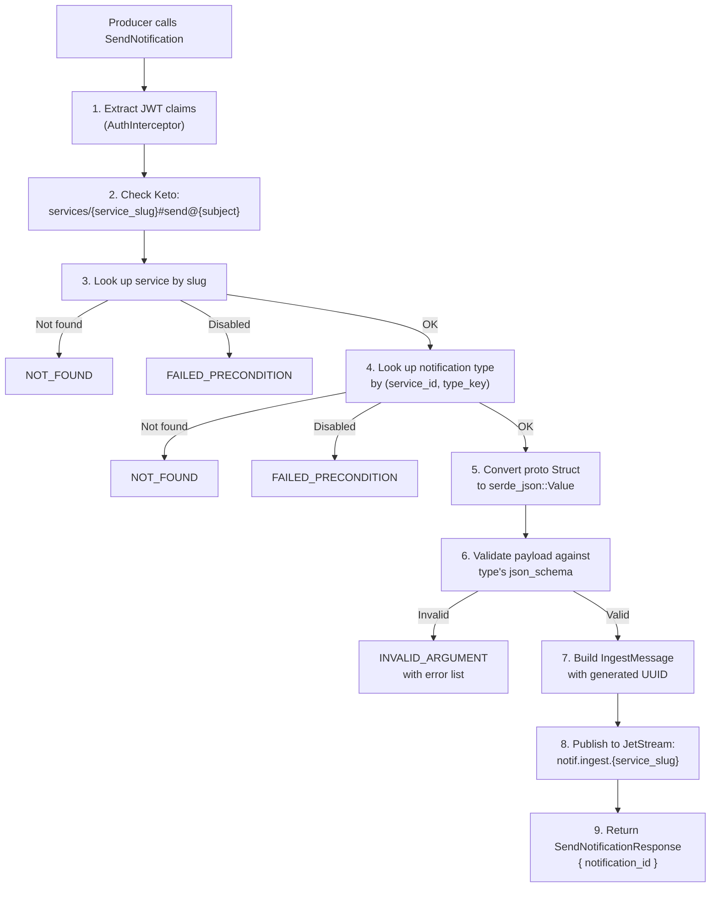

# Schema Registry

## What the Schema Registry Is

The schema registry is a centralized catalog of notification types and
severity levels that producer services can send through Estafeta. It serves
three purposes:

1. **Payload validation**: Each notification type declares a JSON Schema. When
   a notification is sent, its payload is validated against that schema before
   it enters the processing pipeline.
2. **Inbox defaults**: Each notification type specifies default TTL, escalation
   behavior, escalation action, and a default icon, reducing the configuration
   burden on producers.
3. **Runtime management**: Types and levels can be registered, updated,
   enabled, and disabled at runtime through the gRPC `SchemaRegistryService`
   without restarting any Estafeta instance.

The schema registry is exposed via the `SchemaRegistryService` gRPC service,
defined in `proto/estafeta/v1/schema_registry.proto` and implemented in
`grpc/schema_registry.rs`.

## Registering a Producer Service

Before registering notification types, the producer service itself must be
registered via the `AdminService.RegisterService` RPC. This is an admin-only
operation (requires Ory Keto `estafeta:admin#access` permission).

```protobuf
rpc RegisterService(RegisterServiceRequest) returns (Service);

message RegisterServiceRequest {
  string slug = 1;           // unique identifier, e.g. "billing"
  string display_name = 2;   // human-readable name, e.g. "Billing Service"
  string description = 3;    // optional description
}
```

The `slug` is the primary identifier used throughout Estafeta to reference
the service. It must be unique across all registered services. The service
is stored in the `services` table:

```sql
CREATE TABLE services (
    id UUID PRIMARY KEY DEFAULT gen_random_uuid(),
    tenant_id UUID,
    slug TEXT NOT NULL UNIQUE,
    display_name TEXT NOT NULL,
    description TEXT,
    api_key_hash TEXT,
    enabled BOOLEAN NOT NULL DEFAULT true,
    created_at TIMESTAMPTZ NOT NULL DEFAULT now(),
    updated_at TIMESTAMPTZ NOT NULL DEFAULT now()
);
```

Services can be enabled/disabled via `AdminService.DisableService` and
`AdminService.EnableService`. When a service is disabled, `SendNotification`
calls for that service return a `FAILED_PRECONDITION` error.

## Registering Notification Types

Once a service exists, notification types are registered via
`SchemaRegistryService.RegisterType`:

```protobuf
rpc RegisterType(RegisterTypeRequest) returns (NotificationType);

message RegisterTypeRequest {
  string service_slug = 1;
  string type_key = 2;                          // e.g. "invoice_overdue"
  string display_name = 3;                      // e.g. "Invoice Overdue"
  string description = 4;
  google.protobuf.Struct json_schema = 5;       // JSON Schema for payload validation
  int32 default_ttl_seconds = 6;                // 0 means no TTL
  int32 escalation_interval_seconds = 7;        // 0 means no escalation
  int32 max_escalations = 8;
  EscalationAction escalation_action = 9;       // resurface, bump, or elevate
  string default_icon = 10;                     // Material Symbol icon name
}
```

This is an admin-only operation. The implementation:

1. Verifies the caller has admin access via Ory Keto.
2. Looks up the service by `service_slug`.
3. Converts the proto `Struct` to a `serde_json::Value`.
4. Validates the JSON schema is itself a valid JSON Schema using
   `jsonschema::validator_for`.
5. Inserts a row into `notification_types`.
6. Invalidates the schema cache entry for `{service_slug}:{type_key}`.
7. Returns the created `NotificationType`.

The notification type is stored in the `notification_types` table:

```sql
CREATE TABLE notification_types (
    id UUID PRIMARY KEY DEFAULT gen_random_uuid(),
    tenant_id UUID,
    service_id UUID NOT NULL REFERENCES services(id) ON DELETE CASCADE,
    type_key TEXT NOT NULL,
    display_name TEXT NOT NULL,
    description TEXT,
    json_schema JSONB NOT NULL,
    default_ttl_seconds INT,
    escalation_interval_seconds INT,
    max_escalations INT NOT NULL DEFAULT 0,
    escalation_action TEXT NOT NULL DEFAULT 'resurface',
    default_icon TEXT,
    enabled BOOLEAN NOT NULL DEFAULT true,
    created_at TIMESTAMPTZ NOT NULL DEFAULT now(),
    updated_at TIMESTAMPTZ NOT NULL DEFAULT now(),
    UNIQUE (service_id, type_key)
);
```

The `(service_id, type_key)` uniqueness constraint ensures type keys are
unique within a service but can be reused across services.

### Escalation Action

The `escalation_action` field controls what happens when the escalation
scheduler fires for this notification type:

| Value | Behavior |
|---|---|
| `RESURFACE` | Move the notification back to `unseen`, re-triggering the bell badge |
| `BUMP` | Update the notification's timestamp to move it to the top of the inbox |
| `ELEVATE` | Increase the notification's visual priority level |

### Default Icon

The `default_icon` field specifies a Material Symbol icon name (e.g.,
`"receipt_long"`, `"warning"`, `"info"`) that is used as the default icon
for notifications of this type. Individual notifications can override this
by setting the `icon` field on `SendNotificationRequest`.

## Example JSON Schema and Validation

### Registering a Type with a Schema

A billing service might register an "invoice overdue" notification type with
a schema requiring specific fields:

```json
{
  "type": "object",
  "properties": {
    "invoice_id": { "type": "string" },
    "amount_cents": { "type": "integer", "minimum": 0 },
    "due_date": { "type": "string", "format": "date" },
    "customer_name": { "type": "string" }
  },
  "required": ["invoice_id", "amount_cents", "due_date"]
}
```

### How Validation Works

Payload validation occurs at two points:

**1. At send time (synchronous, in the gRPC handler)**

When `NotificationService.SendNotification` is called, the handler:

1. Looks up the notification type from the database.
2. Converts the proto `Struct` payload to a `serde_json::Value`.
3. Calls `schema_validator::validate_payload(&notif_type.json_schema, &payload_value)`.
4. If validation fails, returns `INVALID_ARGUMENT` with the error details.
5. If validation passes, publishes the message to JetStream.

```rust
pub fn validate_payload(schema: &Value, payload: &Value) -> Result<(), Vec<String>> {
    let validator = jsonschema::validator_for(schema)
        .map_err(|e| vec![format!("invalid schema: {e}")])?;

    let errors: Vec<String> = validator
        .iter_errors(payload)
        .map(|e| format!("{e}"))
        .collect();
    if errors.is_empty() {
        Ok(())
    } else {
        Err(errors)
    }
}
```

The `jsonschema` crate (Rust) is used for validation. It supports JSON
Schema draft 2020-12 and earlier drafts.

**2. Dry-run validation (ValidatePayload RPC)**

The `SchemaRegistryService.ValidatePayload` RPC allows producers to test a
payload against a type's schema without actually sending a notification:

```protobuf
rpc ValidatePayload(ValidatePayloadRequest) returns (ValidatePayloadResponse);

message ValidatePayloadRequest {
  string service_slug = 1;
  string notification_type = 2;
  google.protobuf.Struct payload = 3;
}

message ValidatePayloadResponse {
  bool valid = 1;
  repeated string errors = 2;
}
```

This is useful during development or CI to verify payload shapes.

### Validation Error Example

Given the schema above, sending a payload like:

```json
{
  "invoice_id": "INV-001",
  "amount_cents": "not_a_number"
}
```

Would return:

```
valid: false
errors: [
  "\"not_a_number\" is not of type \"integer\"",
  "\"due_date\" is a required property"
]
```

### Permissive Schemas

If no schema is provided during registration, the default schema is:

```json
{"type": "object"}
```

This accepts any JSON object, effectively disabling payload validation for
that notification type.

## Registering Notification Levels

Notification levels define severity/importance categories for a service. They
are registered via `SchemaRegistryService.RegisterLevel`:

```protobuf
rpc RegisterLevel(RegisterLevelRequest) returns (NotificationLevel);

message RegisterLevelRequest {
  string service_slug = 1;
  string key = 2;             // e.g. "critical", "warning", "info"
  string display_name = 3;    // e.g. "Critical"
  int32 severity = 4;         // higher = more severe
  string color = 5;           // optional, for UI rendering
  string icon = 6;            // optional, for UI rendering
}
```

Levels are stored in the `notification_levels` table:

```sql
CREATE TABLE notification_levels (
    id UUID PRIMARY KEY DEFAULT gen_random_uuid(),
    tenant_id UUID,
    service_id UUID NOT NULL REFERENCES services(id) ON DELETE CASCADE,
    key TEXT NOT NULL,
    display_name TEXT NOT NULL,
    severity INT NOT NULL,
    color TEXT,
    icon TEXT,
    UNIQUE (service_id, key)
);
```

The `severity` integer is used during preference resolution. Users can set a
`min_severity` threshold on their service preferences. When a notification is
processed, if its level's severity is below the user's threshold, the
notification is suppressed.

Levels are ordered by severity descending when listed via `ListLevels`.

### Example Levels for a Service

| Key       | Display Name | Severity | Color   | Icon    |
|-----------|-------------|----------|---------|---------|
| critical  | Critical    | 10       | #FF0000 | alert   |
| warning   | Warning     | 5        | #FFA500 | warning |
| info      | Info        | 1        | #0000FF | info    |

## Updating Types and Levels at Runtime

### Updating a Notification Type

```protobuf
rpc UpdateType(UpdateTypeRequest) returns (NotificationType);

message UpdateTypeRequest {
  string service_slug = 1;
  string type_key = 2;
  string display_name = 3;
  string description = 4;
  google.protobuf.Struct json_schema = 5;
  int32 default_ttl_seconds = 6;
  int32 escalation_interval_seconds = 7;
  int32 max_escalations = 8;
  EscalationAction escalation_action = 9;
  bool enabled = 10;
  string default_icon = 11;
}
```

Updates are applied atomically via a single SQL UPDATE. The `enabled` field
can be used to disable a notification type without deleting it. When a type
is disabled, `SendNotification` returns `FAILED_PRECONDITION`.

After a successful update, the cache entry is invalidated immediately on the
instance that handled the request.

### Updating a Notification Level

```protobuf
rpc UpdateLevel(UpdateLevelRequest) returns (NotificationLevel);
```

Updates the display name, severity, color, and icon for an existing level.

### Reading Types and Levels

- `GetType(service_slug, type_key)` -- fetch a single notification type.
- `ListTypes(service_slug, pagination)` -- paginated list of types for a
  service.
- `ListLevels(service_slug)` -- all levels for a service, ordered by
  severity descending.

These read operations do not require admin access.

## Schema Cache

The schema registry data is cached in-process using `moka` async caches.
Two caches are relevant:

### notification_types cache

- **Key**: `{service_slug}:{type_key}` (e.g., `billing:invoice_overdue`)
- **Value**: `Arc<CachedNotificationType>` containing id, service_id,
  type_key, json_schema, default_ttl_seconds, escalation config,
  escalation_action, default_icon, and enabled flag.
- **Max capacity**: 10,000 entries
- **TTL**: 5 minutes (300 seconds)

### notification_levels cache

- **Key**: `{service_slug}:{level_key}` (e.g., `billing:critical`)
- **Value**: `Arc<CachedNotificationLevel>` containing id, key, and severity.
- **Max capacity**: 10,000 entries
- **TTL**: 5 minutes (300 seconds)

### Cache Population

Caches are populated lazily during notification processing. The `Processor`
calls `get_or_load_notif_type` which:

1. Checks the moka cache for the key.
2. On cache hit, returns the cached value immediately.
3. On cache miss, queries the database (`get_service_by_slug` then
   `get_notification_type`), constructs a `CachedNotificationType`, inserts
   it into the cache, and returns it.

The same pattern applies to notification levels via `get_or_load_level`.

### Invalidation on Update

When `RegisterType` or `UpdateType` is called on the `SchemaRegistryService`,
the handler explicitly invalidates the cache entry after the database write:

```rust
let cache_key = AppCaches::notification_type_key(&req.service_slug, &req.type_key);
self.caches.notification_types.invalidate(&cache_key).await;
```

This ensures the next notification processed on that instance will read the
updated schema from the database.

**Cross-instance propagation**: Since caches are in-process (not shared),
other Estafeta instances will continue using the old cached value until the
5-minute TTL expires. This is an intentional trade-off. Schema changes are
infrequent, and a brief window of staleness is acceptable.

## Payload Validation Flow During Ingestion

The complete validation flow for a `SendNotification` call:



Validation happens synchronously in the gRPC handler (step 6), before the
message enters the async pipeline. This means producers receive immediate
feedback on malformed payloads without waiting for async processing.

The schema used for validation is read directly from the database in the
gRPC handler (not from the moka cache). The cache is used by the Processor
during async processing for performance. This means the gRPC handler always
validates against the latest schema version.
